```{r}
#| include: false
library(dplyr)
```

# How do organizations ensure quality control?

:::: fragment
::: {style="color:red; font-size:2em;"}
Applying quality management systems, such as **ISO 9001**
:::
::::

## A key requirement of **ISO 9001:2015** is that:

- Workers are competent
- Competence is ensured through appropriate education, training, or experience

# However

- Science lacks systems for quality management
- Limited time for education, training or developing new skills

# 

These factors contribute to several recurring issues in scientific research, including:

- Misinterpretation of non-significant results [@aczel2018; @murphy_2025]
- Non-reproducible a priori power analyses [@mesquida_2025; @thibault_errors_power]
- Poor adherence to reporting guidelines [@kazak_2018]
- Lack of computational reproducibility [@miske_2026]
- Miscitations [@cobb_miscitation_2024]

## What do these issues have in common?

:::: fragment
::: {style="color:red; font-size:2em;"}
They can be automatically detected
:::
::::

## What can we do from a human factor perspective?

:::: {.fragment .r-fit-text}
::: {style="color:red;"}
Automation
:::
::::

# 

[ There are already a number of tools that perform automated checks on scientific manuscripts ]{style="font-size:1.6em; font-weight:400;"}

## Zotero

```{r fig.align ="center", out.width="80%", fig.show="hold"}
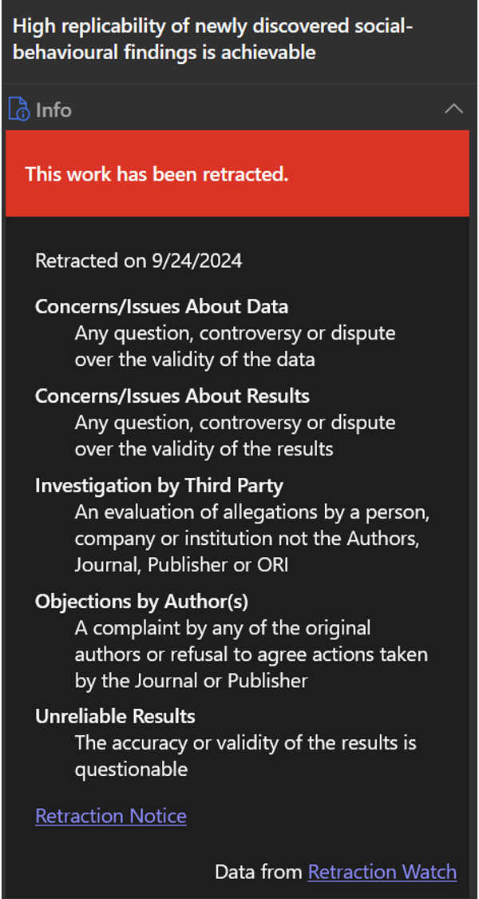
```

## Statcheck

```{r fig.align ="center", out.width="60%", fig.show="hold"}
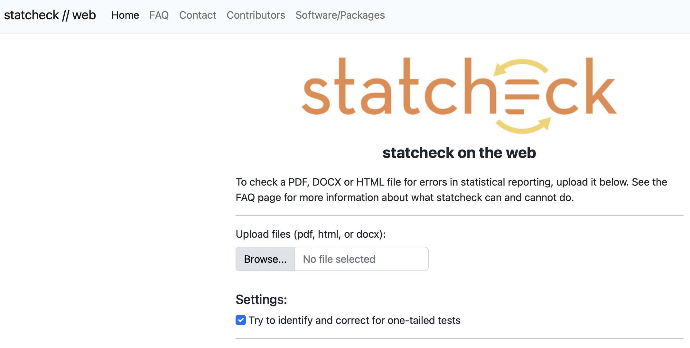
```

**Statcheck** recomputes *p*-values based on test statistics and DFs

## Automation

- In software development, automated checks are routinely used to identify issues before release
- For example, CRAN checks for R packages
- Before submitting a package to CRAN, a battery of tests must be passed

## CRAN checks

- Checking package namespace information ... OK
- Checking package dependencies ... OK
- Checking if this is a source package ... OK
- Checking if there is a namespace ... OK
- Checking for executable files ... OK

Status: OK

# Cran checks for warnings

::: {.fragment style="color:red;"}
Checking R code for possible problems ... NOTE  
drawImage: no visible global function definition for ‘Axis’
:::

::: {.fragment style="color:blue;"}
Consider adding:  
importFrom("graphics", "Axis") to your NAMESPACE file
:::

# 

```{r fig.align ="center", out.width="90%", fig.show="hold"}
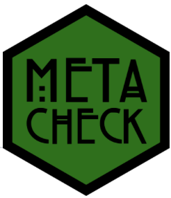
```

## `metacheck`

- An R package containing modules to automate checks in manuscripts

- Each module performs a certain task

- Combines text search, code, and large language models to assess adherence to — or deviations from — scientific best practices

- Can be applied to individual manuscripts or sets of manuscripts

# Two core values in `metacheck`:

[ **Quality Control**: The knowledge, data, code, and software we create will be **verified** for accuracy using publicly available methods and measures, \[...\]. ]{style="font-size:1.6em; font-weight:300;"}

# 

[ **AI Optional**: The use of large language models will be restricted to **classification**, not evaluation of the quality of practice. The use of LLMs will always be **opt-in** and transparently declared. \[...\]. ]{style="font-size:1.6em; font-weight:300;"}

## Workflow

```{r fig.align ="center", out.width="80%", fig.show="hold"}
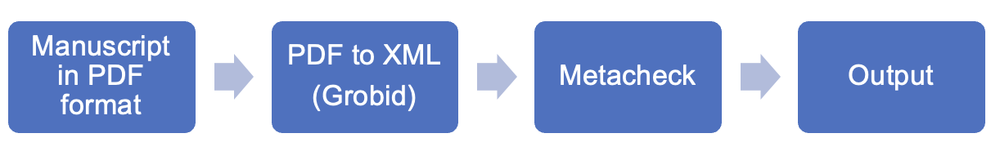
```

## Grobid

```{r fig.align ="center", out.width="80%", fig.show="hold"}
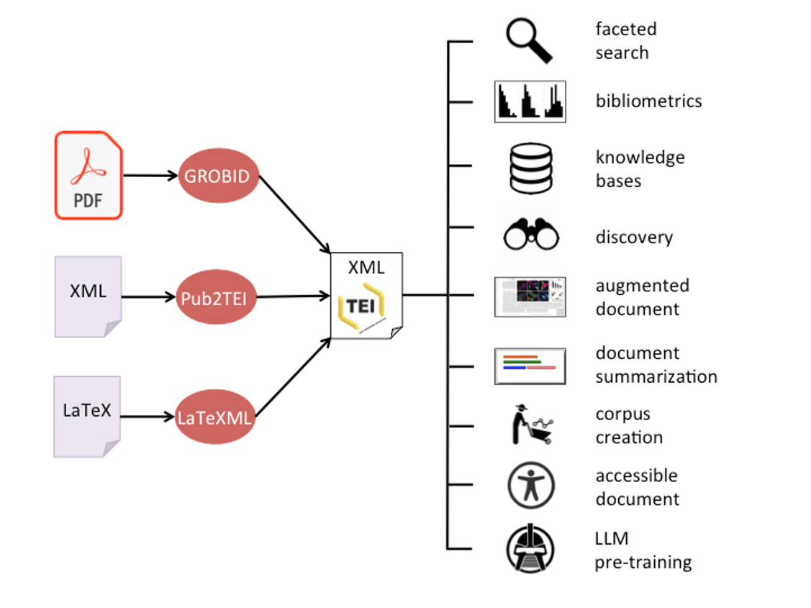
```

## `metacheck` modules

```{r fig.align ="center", out.width="80%", fig.show="hold"}
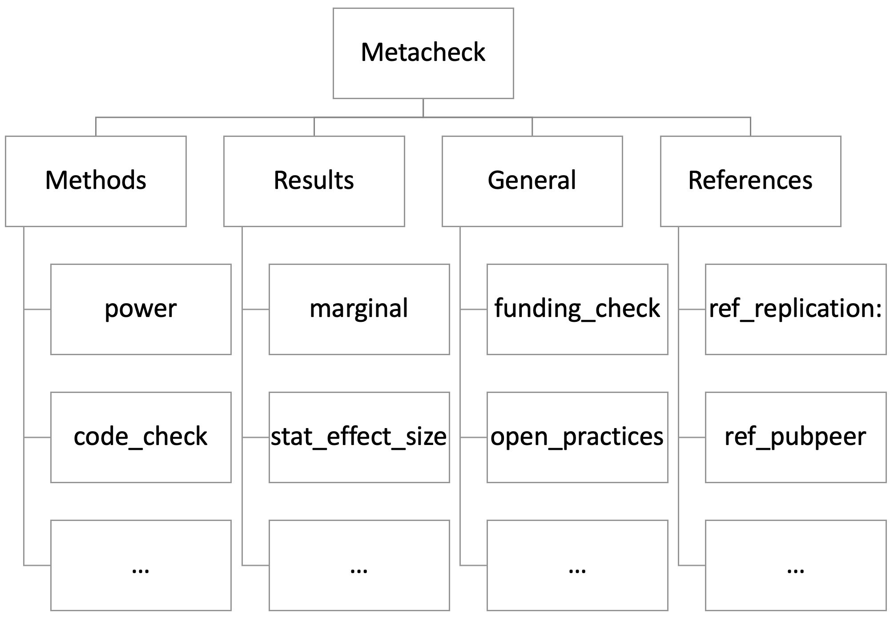
```

## `code_check`

```{r echo = TRUE, message = FALSE}
library(metacheck)
# psychsci is an built-in dataset of 250 open access papers from Psychological Science

(res_code <- module_run(psychsci[[250]], "code_check"))
```

## `marginal`

```{r, echo = TRUE}
(res_marginal <- module_run(psychsci[[13]], "marginal"))
```

```{r echo = TRUE}
res_marginal$table$text
```

## `stat_effect_size`

```{r echo = TRUE, }
(res_stat <- module_run(psychsci[[250]], "stat_effect_size"))
```

```{r echo = TRUE}
res_stat$table |> 
  select(es, test_text) # We could also select `text`, which returns the sentence where the effect size was detected—or is missing.
```

## `stat_p_exact`

```{r echo = TRUE}
(res_exact <- module_run(psychsci[[110]], "stat_p_exact"))
```

```{r echo = FALSE}
res_exact$table |> 
  filter(imprecise == TRUE) |> 
  select(text, section_type, expanded)
```

## A set of papers can be assessed simultaneously

```{r echo = TRUE}
res_exact <- psychsci[1:6] |> 
  module_run("stat_p_exact")

res_exact$summary_table
```

# 

```{r echo = TRUE}
(res <- res_exact$table |> 
  filter(imprecise == TRUE) |> 
  select(text, paper_id, section_type, expanded))
```

# 

```{r echo = TRUE}
res$expanded[2]
```

## More than one module can be executed at once

```{r echo = TRUE}
res_exact <- psychsci[1:5] |> 
  module_run("stat_p_exact") |> 
  module_run("marginal")
  
res_exact$summary_table
```

## Current state of power analyses

"A power analysis indicated that a sample size of 60 was required to achieve 80% power"

- Power analysis statements are often poorly reported

  - e.g., what effect size was assumed? 
  - e.g., what statistical test was used?

- Lack of transparency hinders:
  - reproducibility
  - prevents peers from evaluating their validity
  
# `power`

- Develop a module that detects power analysis statements and assesses their completeness 

- Use of regular expressions to detect power analysis statements

- Lack of standardized reporting practices prevents the development of a module that fully relies on regular expressions

- Use a LLM to extract and classify the information contained in the statement

## Opt-out LLM

```{r echo = TRUE}
llm_use(FALSE) 

res_power <- module_run(psychsci[150], "power")

res_power$table |> 
  select(text, power_type)
```

## Classification result

Classified as **unknown** because there is no information about the type of power analysis reported

```{r echo = TRUE}
res_power$table$text[1]
```

## We use an LLM to classify inputs and return results in a structured JSON format:

<pre style="font-size: 0.8em; line-height: 1.4;">
<code>{
  "apriori": true,
  "test": "paired samples t-test",
  "sample": 20,
  "alpha": 0.05,
  "power": 0.8,
  "es": 0.4,
  "es_metric": "Cohen's d"
}</code>
</pre>

## LLM Prompt
```{r echo = TRUE}
system_prompt <- "Does this sentence report an a priori power analysis? If so, return the test, sample size, significance level (alpha), power level, effect size, and effect size metric, plus any other relevant parameters, in JSON format like:

{
  \"apriori\": true,
  \"test\": \"paired samples t-test\",
  \"sample\": 20,
  \"alpha\": 0.05,
  \"power\": 0.8,
  \"es\": 0.4,
  \"es_metric\": \"Cohen's d\"
}

If not, return:

{
  \"apriori\": false
}

Answer only in valid JSON format, starting with { and ending with }."
```

## Opt-in LLM

```{r echo = TRUE}
power <- psychsci[[150]] |>
  search_text("power") |>
  search_text("[0-9]") 

llm_use(TRUE)
llm_power <- llm(power, system_prompt)
```

## `power` module output

```{r echo = TRUE}
json_expand(llm_power, "answer") |>
  dplyr::select(text, apriori:es_metric)
```

## `metacheck` as a shiny app

```{r fig.align ="center", out.width="90%", fig.show="hold"}
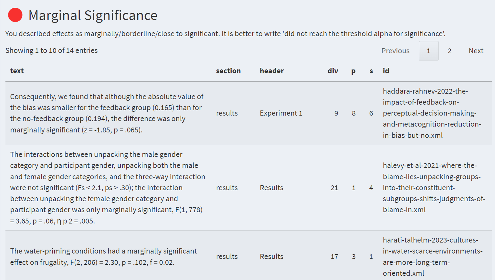
```

# `metacheck` team

```{r fig.align ="center", out.width="90%", fig.show="hold"}

```

# Current projects

## Module validation

- Create ground truth data sets
- Module validation
- Validation as a reproducible and reusable workflow

```{r fig.align ="center", out.width="70%", fig.show="hold"}
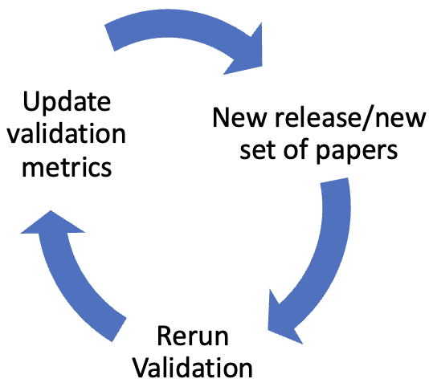
```

## Making Validation Workflows FAIR
- The number of available tools is rapidly increasing
- Validation efforts are often opaque, making them difficult to reproduce or reuse

- Collaboration with Michèle Nuijten (Tilburg University):
  - What defines a FAIR validation workflow?
  - How FAIR are current validation practices?
  - Develop guidelines for FAIR validation workflows
  - Build a database of FAIR validation workflows

## `datacheck`

- Levi Baruch (MEP student)

- Often data and code repositories are messy

- Lack of standardization and quality control

- Developed a module that assess data consistency and data and code repository quality

# `psych_trove`

```{r fig.align ="center", out.width="90%", fig.show="hold"}
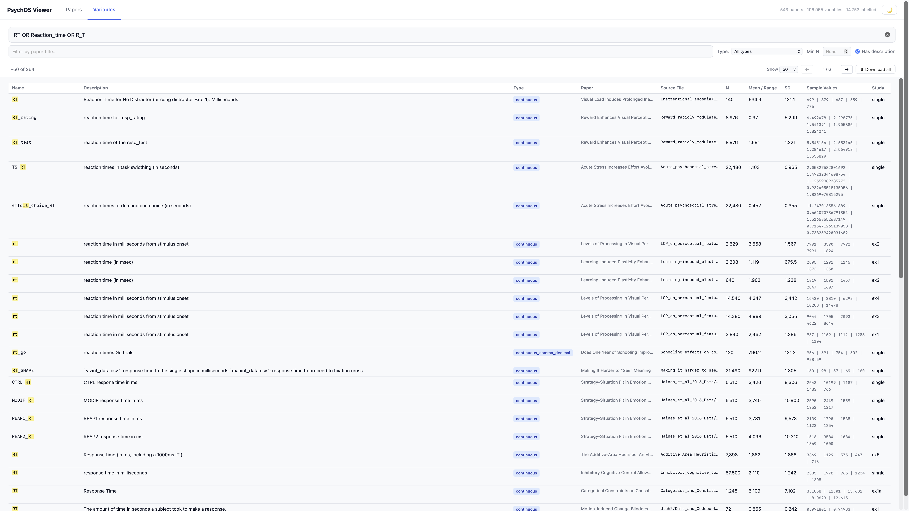
```

# `psych_trove`

```{r fig.align ="center", out.width="70%", fig.show="hold"}
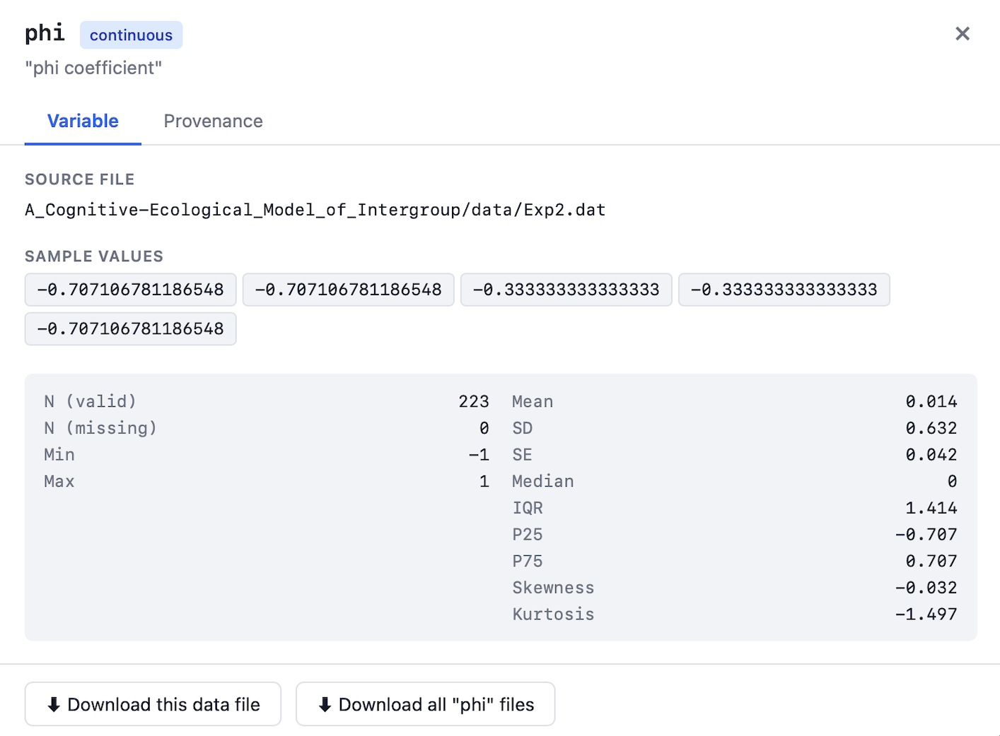
```

# Miscitations

```{r fig.align ="center", out.width="70%", fig.show="hold"}
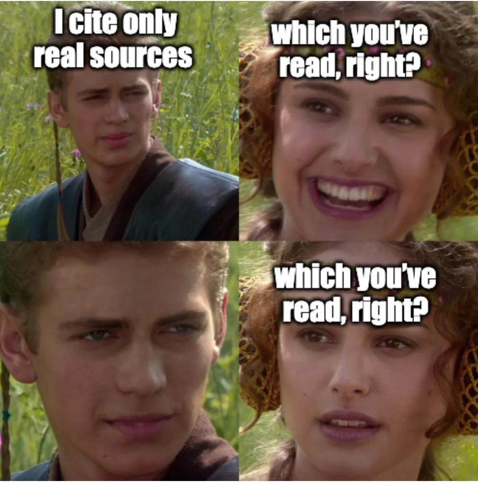
```

## Miscitations in pyshcology

Cobb et al. -@cobb_miscitation_2024 found that out of 3,347 citations:

- ~81% were accurate 

- ~9% failed to include important nuances of results

- ~10% completely mischaracterized original findings

## `miscitation`

- Mink Veltman (MEP student)

- Created a database of commonly miscited papers

- Authors can log papers that are frequently miscited

- `metacheck` detects citations included in the database and provides guidance on how it should be cited

## `metacheck` report

- Hadeel Khawatmi (research internship)

- Performed a usability study and developed a report format based on qualitative research that clearly communicates `metacheck` information in a way users find useful

- [Metacheck report](https://www.scienceverse.org/metacheck/report-example.html)

## Reactance and trust to `metacheck` reports

- Ties and Pamir (BEP students)

- We can automatically email authors a `metacheck` report based on their preprint. But, will scientists appreciate this? And will they trust its reliability?

- Assess peer reactions to `metacheck` reports, with a focus on:

  - Trust in automated assessments;

  - Perceived usefulness;

  - Willingness to use or adopt MetaCheck tools in practice

# Reach out!

[ We are happy to work with you on using `metacheck` for metascience, or to create community-specific modules! ]{style="font-size:1.6em; font-weight:400;"}

# Thanks!

# 

Consider registering for the conference [ Transparency, Technology and AI on Peer Review ]{style="font-size:1.6em; font-weight:600;"} on June 5 at TU/e

```{r fig.align ="center", out.width="70%", fig.show="hold"}

```

# References